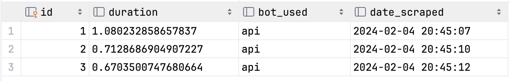
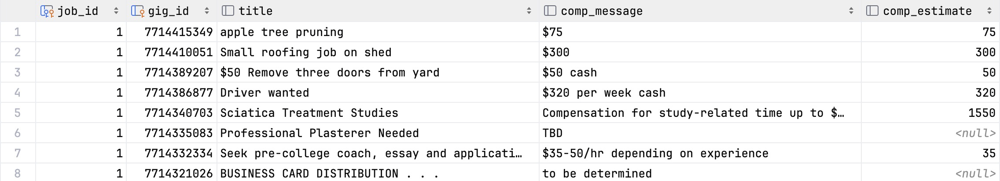
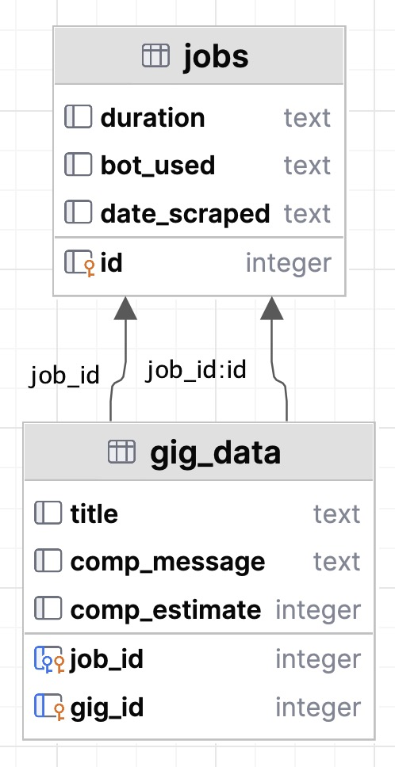

# Craigslist-Gigs-Scraper

Scrape Boston's Craigslist Gigs page.

## Setup

Undetected-Chromedriver does not work on Python 3.12 yet.

```
$ git clone [url]
$ python3.11 -m venv venv
$ source venv/bin/activate
$ pip install -r requirements.txt
$ python scraper.py
```
Example Output:
```
2024-02-04 20:52:09,748 - craigslist_scraper.db_manager - INFO - Created new database at database.db
2024-02-04 20:52:09,748 - craigslist_scraper.client - INFO - Using api to scrape data
2024-02-04 20:52:10,142 - craigslist_scraper.bots.api_bot.api_bot - INFO - Sent request to base url get cookie. Status code: 200
2024-02-04 20:52:10,471 - craigslist_scraper.bots.api_bot.api_bot - INFO - Sent request to /.../full endpoint to get tokens. Status code: 200
2024-02-04 20:52:10,475 - craigslist_scraper.bots.api_bot.api_bot - INFO - Using Craigslist API version 8
2024-02-04 20:52:10,579 - craigslist_scraper.bots.api_bot.api_bot - INFO - Sending request to /../batch endpoint to get data. Gigs: start = 0 count = 1080
2024-02-04 20:52:10,677 - craigslist_scraper.bots.api_bot.api_bot - INFO - Sent request to /.../batch endpoint. Status code: 200
2024-02-04 20:52:10,704 - craigslist_scraper.client - INFO - Scraped all gigs! Number: 673
2024-02-04 20:52:10,715 - craigslist_scraper.db_manager - INFO - Finished updating database
```

### Example Data




### DB Schema
